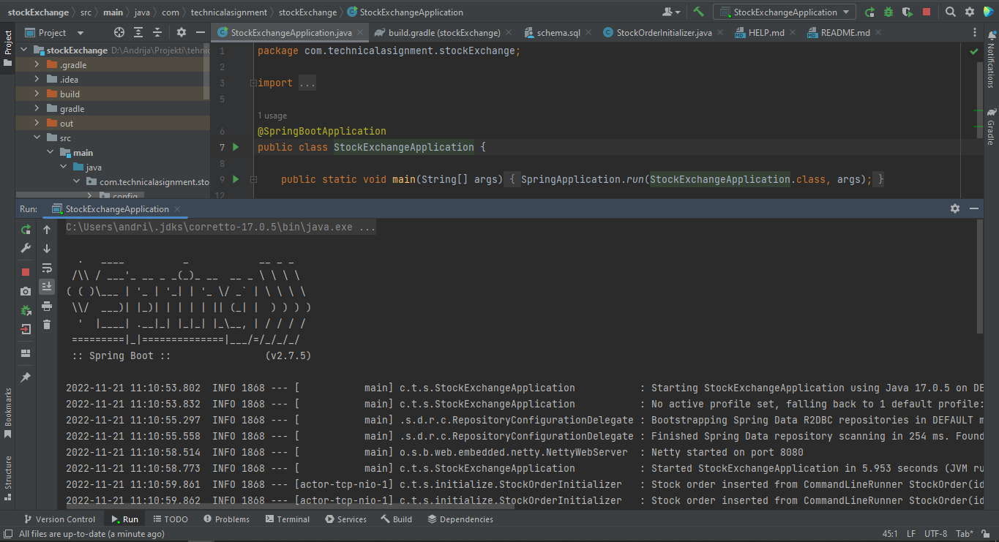
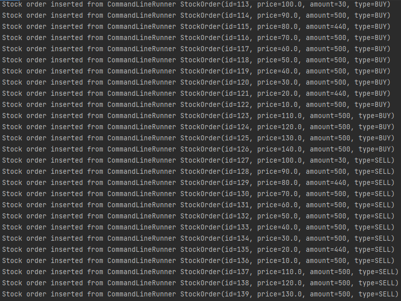
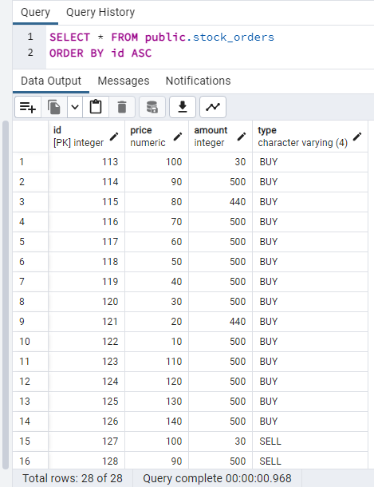
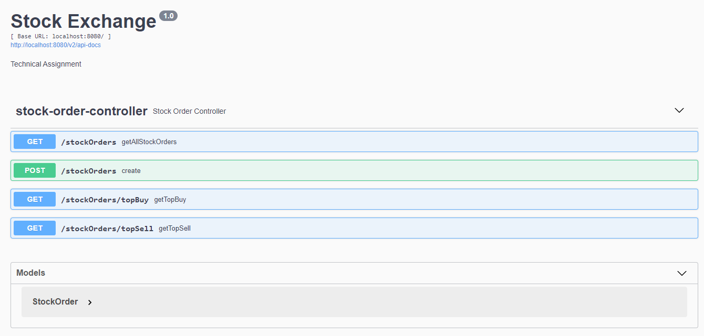
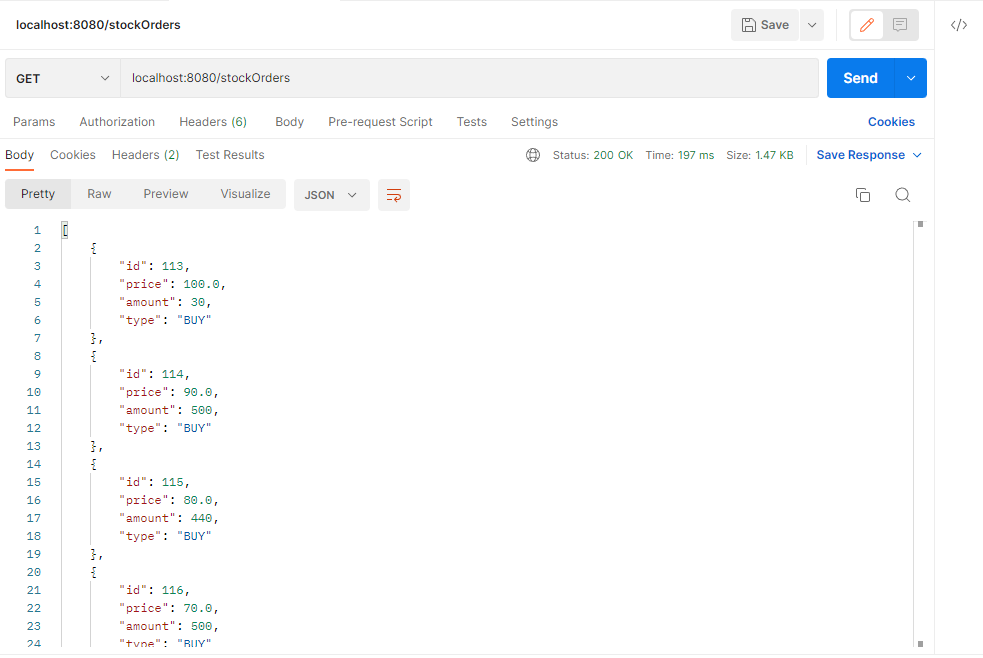
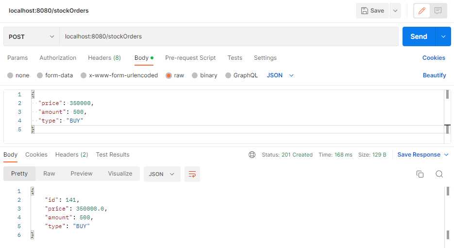
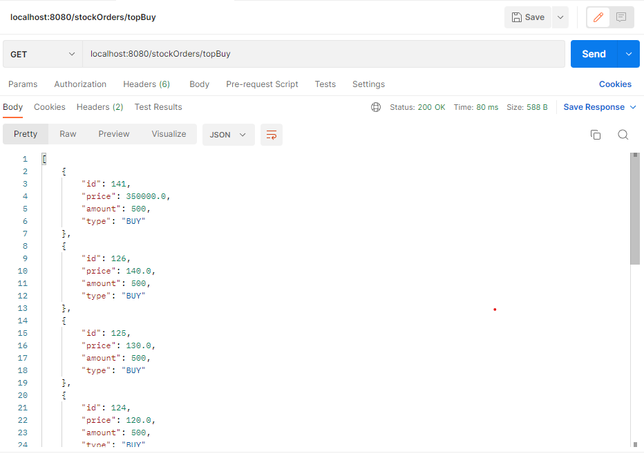

# TECHNICAL ASSIGNMENT 
## Candidate: Andrija Petrovic

I used _Spring Boot_ and _Postgresql_ to create this project. I used _Postman_ to test the API. 
Since I haven't created a self-contained deployment package, I'll walk you through getting 
the application up and running here.

## Launching the application

When starting the application, the _StockOrderInitializer_ class automatically enters the initial 
data into the database using the _initialDataSetup_ method.   
   
   
   

## About REST API

After launch, you can also see API information at http://localhost:8080/swagger-ui/index.html#/stock-order-controller   
   

The first endpoint returns all data from the database, since there is not much data, I did not perform pagination   
   

After that, we have an endpoint for entering a new order, which returns data about the entered order    
   

And finally, the last 2 endpoints that return data on top 10 BUY and top 10 SELL orders   
   
   

### If you evaluate my project positively, I would be happy to show you all the functionalities and explain how I created them.